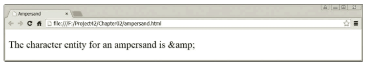

# Lab 2 - The Navigator

You have two projects to complete.

## Part 1 - Navigation List

In the `index.html` file, create a navigation menu system for moving through the pages of a website.

It will have the following menu items:

`Home`, `Lighting`, `Small Home Appliances`, `Support`, and `Contact`

The `Lighting` item will include a sub-menu containing: `Energy Saving Lamps`, `LED Lamps`, and `Halogen Lamps`.

Under `Halogen Lamps`, add the sub-sub-menu: `Halogen Classic` and `Halogen Spot`.

Hints:
* You do not have to point the links to actual documents.
* You don't have to worry about how the menu looks.
* A menu system is just a structured list of hyperlinks on a page.

## Part 2 - Symbols 

This one is more like a little puzzle. In the `ampersand.html` file, write HTML code that will display the following in a browser window:

## Keywords for Unit 2

* structure
* presentation
* CSS
* semantics
* `<b>`
* `<i>`
* `<strong>`
* `<em>`
* class
* tables
* lists
* `<article>`
* `<section>`
* `<nav>`
* `<aside>`
* `<header>`
* `<hgroup>`
* `<footer>`
* `<a>`
* href
* URLs (absolute and document relative)
* reserved characters