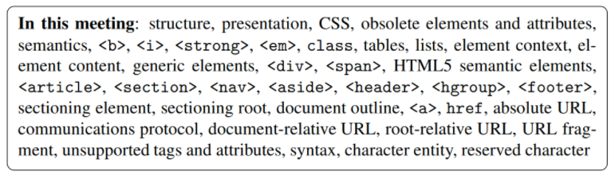

# Instructions  

You have two projects to complete.

## Part 1 - Navigation List

In the `index.html` file, create a navigation menu system for moving through the pages of a website.

It will have the following menu items:

`Home`, `Lighting`, `Small Home Appliances`, `Support`, and `Contact`

The `Lighting` item will include a sub-menu containing: `Energy Saving Lamps`, `LED Lamps`, and `Halogen Lamps`.

Under `Halogen Lamps`, add the sub-sub-menu: `Halogen Classic` and `Halogen Spot`.

Hints:
* You do not have to point the links to actual documents.
* You don't have to worry about how the menu looks.
* A menu system is just a structured list of hyperlinks on a page.

## Part 2 - Symbols 

In the `ampersand.html` file, write HTML code that will display the following in a browser window:

## Keywords from Chapter 2

